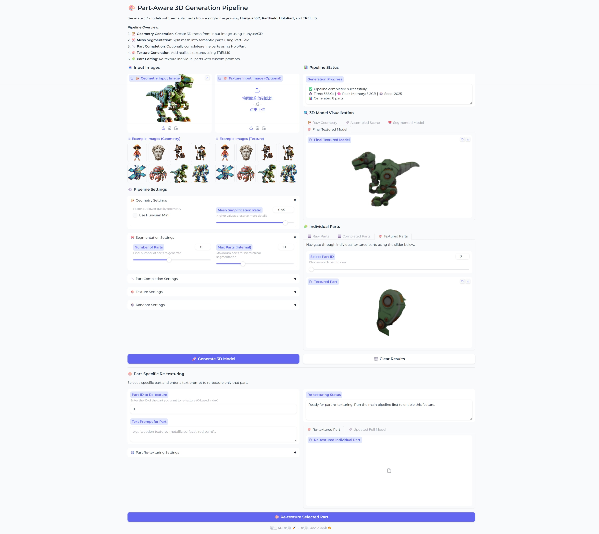

# Part3DGen: Structured Mesh Generation from a Single Image
This project demonstrates a simple workflow to generate structured 3D meshes from a single RGB image and support part editing. It's built upon awesome works in the community like Hunyuan3D/TRELLIS/HoloPart/PartField etc.

### Video Demo


### Gradio Demo (See Below)



## Setup 

### Requirements
The code has been tested on CentOS8/Ubuntu22.04 + Python3.10 + CUDA 12.1. About 15GB VRAM is required to run in low-vram mode (no more than 10 parts for segmentation). If you have sufficient VRAM(24GB or more), you may consider to run in non-low-vram mode, which keeps all models in the GPU memory.

### Instruction
```
git clone --recurse-submodules https://github.com/FishWoWater/part3dgen

conda create -n partgen3d python=3.10 
# first install pytorch with cuda12.1
pip install torch==2.4.0 torchvision==0.19.0 torchaudio==2.4.0 --index-url https://download.pytorch.org/whl/cu121

# then install trellis and partfield dependency, while reusing the same env
cd thirdparty/TRELLIS
. ./setup.sh --basic --xformers --flash-attn --diffoctreerast --spconv --mipgaussian --kaolin --nvdiffrast
# for systems with glibc < 2.29 , you may need to build kaolin from source manually
pip install kaolin -f https://nvidia-kaolin.s3.us-east-2.amazonaws.com/torch-2.4.0_cu121.html

cd .../thirdparty/partfield 
pip install lightning==2.2 h5py yacs trimesh scikit-image loguru boto3
pip install mesh2sdf tetgen pymeshlab plyfile einops libigl polyscope potpourri3d simple_parsing arrgh open3d psutil 
pip install torch-scatter -f https://data.pyg.org/whl/torch-2.4.0+cu121.html

# install hunyuan3d 
cd .../thirdparty/Hunyuan3D-2
pip install -r requirements.txt 
pip install -e .
# we are only going to use hunyuan turbo for geometry generation
# so no need to install the texture relevant depdendencies

# optional, only required if you are going to use part completion 
cd .../thirdparty/holopart
pip install -r requirements.txt 
```
To download all models required, run `sh download_models.sh`
To check that all dependencies are correctly installed, run `sh sanity_check.sh`

For a one-in-all installation, run `sh install.sh`

## Usage 
### Structured Mesh Generation
```
## for all demo cmds refer to demo.sh
# given a single image 
python demo.py --image-path assets/example_image/typical_humanoid_mech.png --low-vram

# given an image directory 
python demo.py --image-dir assets/example_image --low-vram

# bash file 
bash demo.sh
```

### Re-texture some part 
```
# a task directory (from previous generation) should be provided
python demo_retexture.py --task-dir exp_results/pipeline/path/to/task --retexture-part-id 0 --retexture-prompt "Abdandoned, rusty"

# bash execution
bash demo_retexture.sh
```

### Gradio demo 
```
python gradio_demo.py
```

### Notes
1. HoloPart sometimes produces over-completed models.
2. If part completion is enabled, some parts MAY NOT BE TEXTURED in trellis texture generation because of occlusion, to texture that part better, you may consider to re-texture it using another image or text prompt.
3. By default Hunyuan3D-2 produces Y-UP models, while TRELLIS detail variation expects a Z-UP mesh.


## Acknowledgement 
1. [PartField](https://github.com/nv-tlabs/PartField) for mesh segmentation 
2. [Hunyuan3D-2](https://github.com/Tencent-Hunyuan/Hunyuan3D-2) for image-to-3d geometry generation
3. [TRELLIS](https://github.com/Microsoft/TRELLIS) for texture generation
4. [HoloPart](https://github.com/VAST-AI-Research/HoloPart) for part completion (it's slow and optional)


## Citation 
If you find this work useful, please consider citing:
```
@software{Part3DGen,
  author = {Junjie Wang},
  title = {{Part3DGen}: Structured Mesh Generation from Single RGB Image},
  url = {https://github.com/FishWoWater/part3dgen},
  version = {0.1},
  year = {2025},
}
```

## Discussion 
This project is only a Proof-of-Concept to demonstrate the capabiltiy to generate structured 3D meshes, instead of generating monolithic objects. It's completely based on existing excellent works.
I have also found concurrent native solutions for this task, they are awesome:
1. [PartCrafter](https://wgsxm.github.io/projects/partcrafter/): https://wgsxm.github.io/projects/partcrafter/
2. [PartPacker](https://github.com/NVlabs/PartPacker): https://github.com/NVlabs/PartPacker
